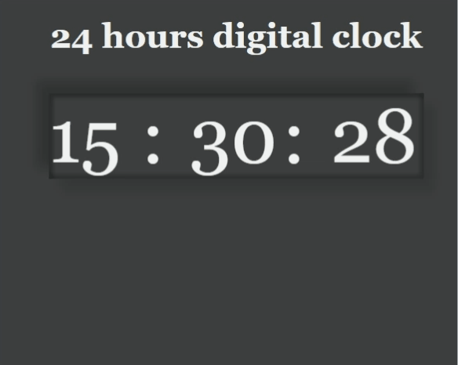
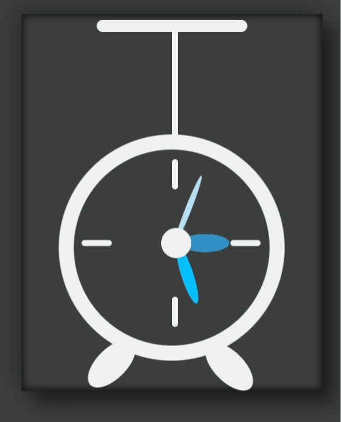

# 100-days-of-code
 This is my repository for #100DaysOfCode challenge. I will update [log file](log.md) daily until I complete the challenge. 
 
 This was suggested to me by the lab where I am working as a Research Assistant since June 2019. Check out the lab at [Vision and Learning Research Lab](http://vision-learning.media-tics.net/).

## My latest project in this challenge was (A Digital and an Analog clock)

 Source code for this project can be found [here](code/Day003-DigitalAndAnalogClock/).

 

 

## Follow me on Social Media

 [Twitter](https://twitter.com/Shaykhiyan) where I will be keeping myself publically accountable throughout this journey.

 [LinkedIn](https://www.linkedin.com/in/its-abdullah-aslam/) I will be occasionally posting about my progress
