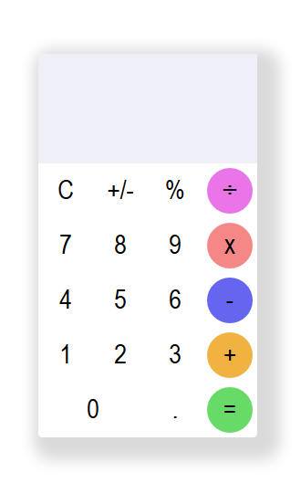

# This is my first project in the #100DaysOfCode challenge

## Technologies used
 * HTML5
 * CSS3
 * JavaScript (jQuery)

## Thoughts
 I did not design the interface and do not take credit for it. Interface is inspired from [here](https://static.collectui.com/shots/2498081/calculator-day-22-large). 
 
 This project helped me brushup on Front-end Web development concepts.

 ## Have a look at what I have achieved

 
