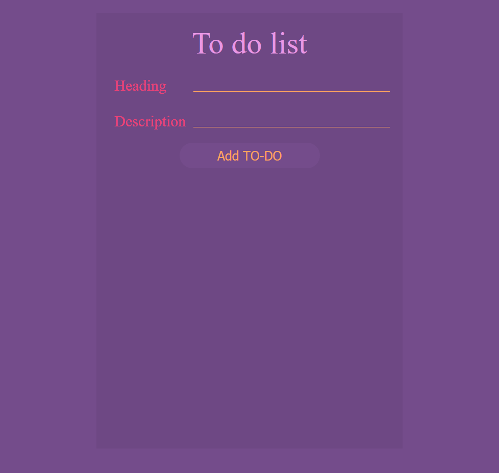
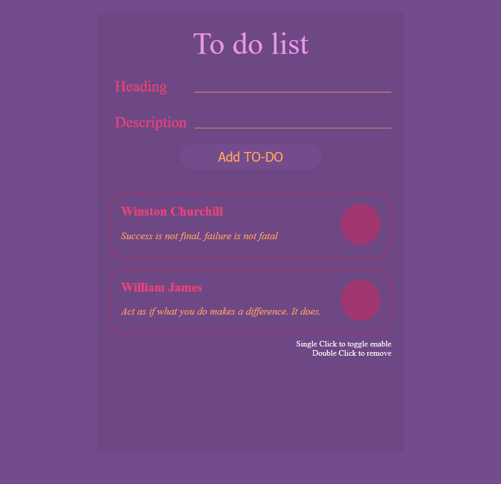
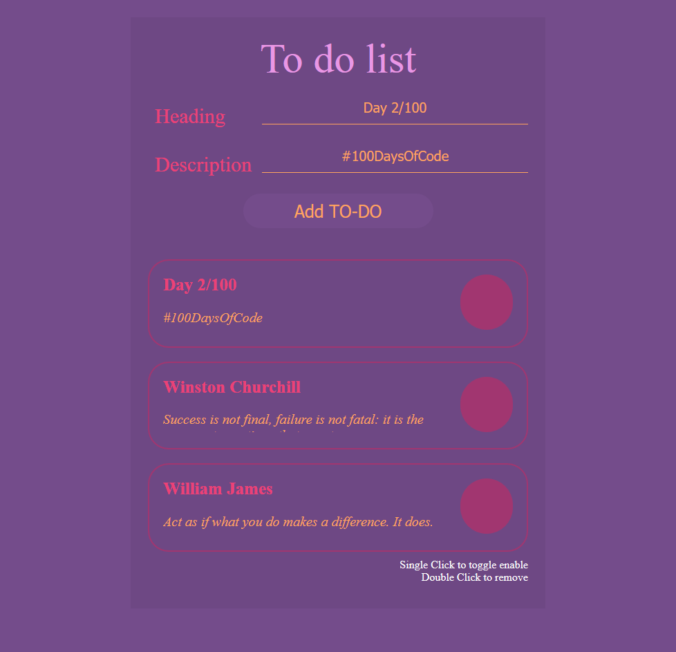

# This is my second project in the #100DaysOfCode challenge

## Technologies used
 * HTML5
 * CSS3
 * JavaScript (jQuery)

## Thoughts
 Today I designed a to-do-list app. Interface is inspired from [CodeMyUI](https://codemyui.com/css-only-checkbox-into-material-design-todo-list/). The color scheme used can be found [here](https://digitalsynopsis.com/wp-content/uploads/2019/11/color-schemes-palettes-16.png). 
 
 I dug deeper into HTML5 and understood the purpose of `<main>` tag. In todays project I had to added HTML elements dynamically using jQuery. So, I learnt a new concept of delegates and used the same `this` keyword by calling the delegate on its parent element, to access the dynamically added HTML element.

 This project helped me brushup on Front-end Web development concepts.

## Here are some images of what I made

 
 
 
 
 