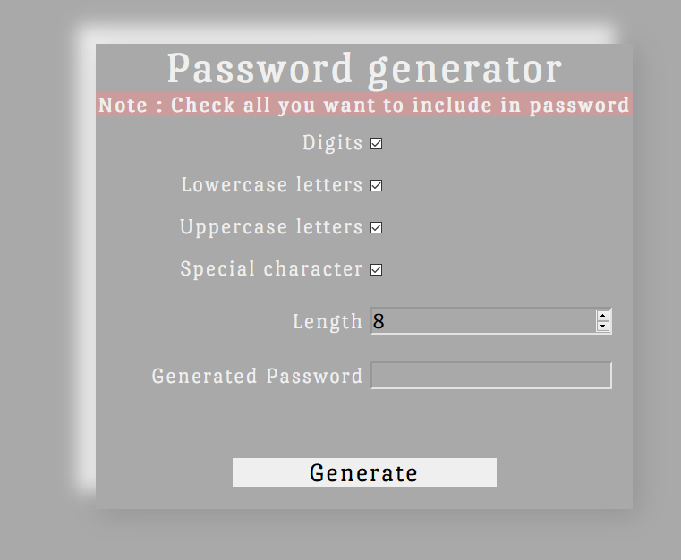
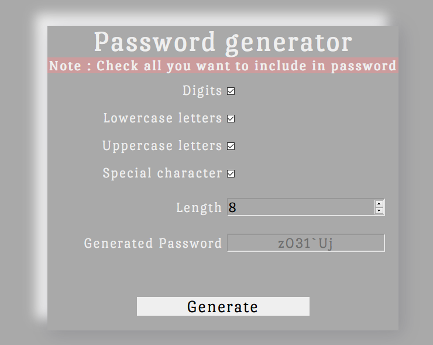
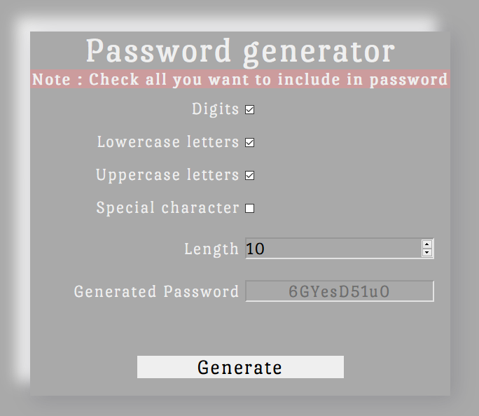
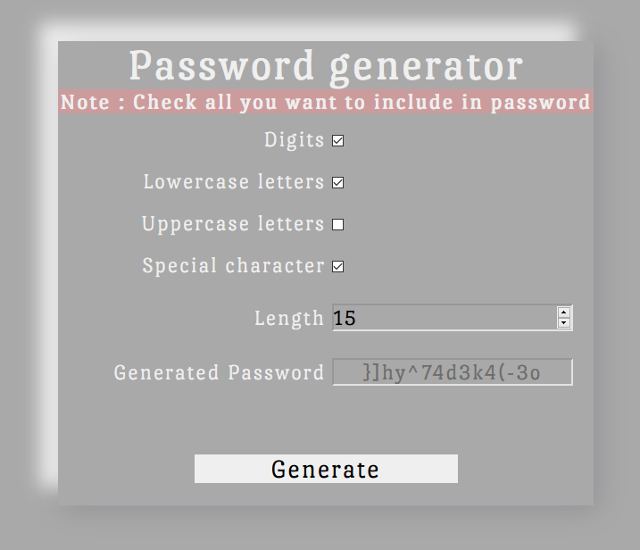

# This is my fourth project in the #100DaysOfCode challenge

## Technologies used
 * HTML5
 * CSS3
 * JavaScript (jQuery)

## Thoughts
 Today I developed a password generator using JavaScript. Frontend logic has been implemented in HTML and CSS. Backend has been implemented in jQuery and JavaScript. I couldn't find a way to implement copy-to-clipboard functionality. 

 This project helped me brushup on Front-end Web development concepts.

## Here are some images of what I made

 

 

 

 